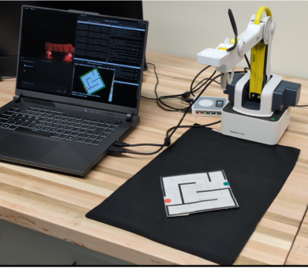
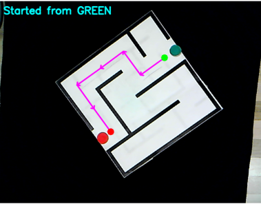
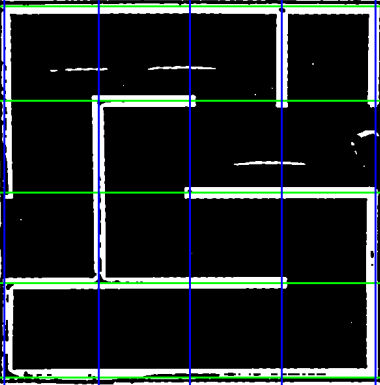

# autonomous-maze-solver
[](https://docs.ros.org/en/humble/)
[](https://www.python.org/)

Autonomous robot that detects, plans, and navigates mazes of varying sizes (3×3, 4×4, 5×5) using computer vision and BFS pathfinding.

## 🎥 Demo

[**Watch Video Demo**](https://youtu.be/uBfR9sYYWY) | [**website**](https://nivaspiduru.github.io/portfolio/portfolio-2-maze-solver/)

### System in Action

<p align="center">
  
  
</p>

<p align="center">
  
</p>

*Figure: (Top Left) Dobot Magician with physical maze. (Top Right) BFS path planning from green start to red end. (Bottom) Computer vision grid extraction.*

## 🏗️ System Architecture
```
Vision Solver Node → Maze detection + BFS pathfinding
         ↓
Converter Node → Homography transformation (pixel → robot coordinates)
         ↓
Executor Node → Motion planning + Dobot control
```

## 🛠️ Technologies

**Framework**: ROS2 (Humble)  
**Language**: Python 3.10  
**Computer Vision**: OpenCV (HSV segmentation, Hough transform, perspective warping)  
**Algorithm**: Breadth-First Search (BFS)  
**Hardware**: Dobot Magician Lite

## 📊 Performance

- **Maze Detection**: 95% success under controlled lighting
- **Path Finding**: 100% optimal (BFS guarantee)
- **Positioning Accuracy**: ±3mm
- **Solution Time**: 8-12 seconds (detection → execution)
- **Tested Sizes**: 3×3, 4×4, 5×5 mazes

## 📦 Installation & Usage

### Prerequisites
```bash
# Install ROS2 Humble + dependencies
sudo apt install ros-humble-cv-bridge
pip install opencv-python numpy
```

### Run
```bash
# Terminal 1: Vision + Path Planning
ros2 run maze_solver vision_solver_node

# Terminal 2: Coordinate Conversion
ros2 run maze_solver converter_node_maze

# Terminal 3: Robot Execution
ros2 run maze_solver executor_node
```

## 🎓 Context

**Course**: RAS 545 - Robotics and Autonomous Systems (Midterm 2)  
**Institution**: Arizona State University  
**Date**: November 2025

## 👨‍💻 Author

**Nivas Piduru**  
MS Robotics, Arizona State University  
📧 nivaspiduru@gmail.com | 🔗 [Portfolio](https://nivaspiduru.github.io)

## 🙏 Acknowledgments

Developed with AI assistance using Claude AI via [ROS MCP Server](https://github.com/GrayMatter-Robotics/ros-mcp-server) for accelerated debugging and development.
